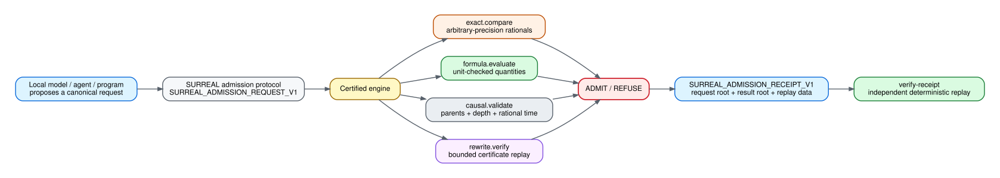
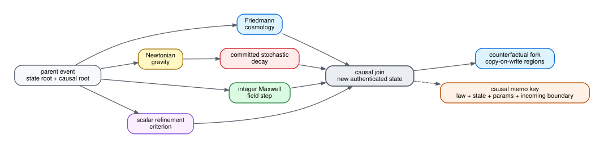
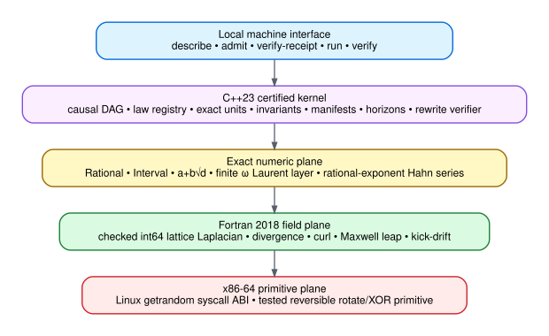

# MANTLE-S.U.R.E.A.L.

<p align="left">
  
  
  
  
</p>

**Symbolic Universe Runtime for Reversible Exact Adaptive Laws.**  
A local causal admission and scientific-computing kernel. A model, agent, compiler, or ordinary program proposes a bounded request; SURREAL runs the relevant certified engine and returns an independently replayable result.

**SURREAL is not a language model.** Bring the local model or program you want. SURREAL has no hosted API or model-vendor SDK dependency.

<p align="center">
  
</p>

## What it actually does

| Surface | Implemented behavior |
|---|---|
| `describe` | Emits the local admission protocol and supported operations. |
| `admit` | Parses a bounded `SURREAL_ADMISSION_REQUEST_V1`, executes the real engine, returns `ADMIT` or `REFUSE` plus a canonical receipt. |
| `verify-receipt` | Replays the embedded request locally and verifies the receipt roots and result deterministically. |
| `exact.compare` | Compares arbitrary-precision rational values exactly. |
| `formula.evaluate` | Evaluates the formula atlas through exact, dimension-checked quantities and SI canonicalization. |
| `causal.validate` | Validates parent existence, bounded parent sets, graph depth, and rational local-time admission. |
| `rewrite.verify` | Replays a bounded law-program rewrite certificate and verifies the claimed transformation. |
| `run` / `verify` | Executes a configured reference universe and verifies its manifest, events, configuration, and committed entropy artifacts. |

Current admission operations default to `entropy_policy=forbid`: a deterministic admission request cannot consume hidden randomness.

## Certified mathematics

`Rational` uses arbitrary precision. `Interval` stores closed rational enclosures. The symbolic plane implements exact quadratic elements `a + b√d`, a finite Laurent layer in `ω`, and finite rational-exponent Hahn series. Certified square roots are enclosed with arbitrary-precision integer bounds rather than host floating-point guesses.

The quantity layer tracks physical dimensions and exact unit-to-SI conversion factors. Arithmetic exactness and dimensional validity are separate checks: incompatible dimensions are rejected before a formula is admitted.

## Executed scientific kernels

The configured universe currently executes:

* Friedmann expansion with selectable ΛCDM, Einstein–de Sitter, and radiation-dominated law worlds
* softened pairwise Newtonian gravity with rational interval enclosures
* pairwise Coulomb dynamics
* inertial photon propagation
* committed stochastic two-body decay
* rest-mass to radiant-energy bookkeeping
* periodic exact-integer vacuum Maxwell lattice evolution with discrete divergence certificates
* scalar-field refinement detection from a discrete curvature criterion

The formula atlas also evaluates bounded reference formulas across mechanics, cosmology, electromagnetism, thermodynamics, fluid/plasma quantities, atomic/nuclear references, compact objects, and Planck scales. See [`PHYSICS_SCOPE.md`](PHYSICS_SCOPE.md) for the exact claim boundary.

<p align="center">
  
</p>

## Causal state instead of a global log

Each admitted event records its parents, derived depth, rational local time, region, law, before/after state hashes, invariant hash, entropy root, and memo-reuse status.

Deterministic memoization includes the **incoming causal boundary** in its key. Byte-identical local state reached through a different causal past is not silently assumed to have the same future.

Counterfactual branches share immutable region states copy-on-write. `fork()` intentionally preserves common-random-number replay semantics; `fork_independent(domain)` derives a deterministic Philox substream for independent branch experiments.

## Runtime layers

<p align="center">
  
</p>

**C++23** owns certified arithmetic, units, causal state, law admission, Philox replay entropy, authenticated histories, horizon archives, manifests, and rewrite verification.

**Fortran 2018** owns checked exact-`int64` periodic field kernels: Laplacian, divergence, curl, Maxwell leap, and kick-drift operations.

**x86-64 assembly** is intentionally small: the Linux `getrandom(2)` syscall ABI plus a tested reversible rotate/XOR primitive. It is not presented as a security or performance advantage.

## Local admission example

```sh
./build/surreal describe

cat > request.sur <<'EOF'
SURREAL_ADMISSION_REQUEST_V1
request_id=demo
operation=exact.compare
lhs=2/4
rhs=1/2
relation=eq
EOF

./build/surreal admit request.sur > receipt.sur
./build/surreal verify-receipt receipt.sur
```

The receipt is not a model confidence score. It records what concrete engine was run and enough canonical data to replay the decision locally.

## Build

Linux x86-64 requirements: GCC/G++ with C++23 support, GFortran, GNU Make, Boost headers, and binutils. Clang is used by the independent compiler gate.

```sh
make -j2 test
make audit
```

Additional release gates:

```sh
make test-asan
make test-ubsan
make test-clang
```

The repository includes native core/runtime/failure/admission tests, seeded reproducibility checks, a Philox known-answer vector, fork-semantics tests, unit rejection/conversion tests, overflow refusal, public-hook reachability checks, and ELF RELRO/NOW/non-executable-stack auditing.

## Scope

SURREAL is a research-grade executable substrate, **not** a complete astrophysical simulator and **not** a proof that a physical model is correct. It does not currently implement the Einstein field equations, GRMHD, radiation transport, stellar reaction networks, QFT, Standard Model scattering, chemistry, or planet formation.

The symbolic layer is also finite and computable; it does not claim to materialize the proper class of all surreal numbers.

Detailed boundaries and verification notes live in [`ARCHITECTURE.md`](ARCHITECTURE.md), [`PHYSICS_SCOPE.md`](PHYSICS_SCOPE.md), [`SECURITY.md`](SECURITY.md), and [`VERIFICATION.md`](VERIFICATION.md).

## License

Apache License 2.0. See [`LICENSE`](LICENSE) and [`THIRD_PARTY_NOTICES.md`](THIRD_PARTY_NOTICES.md).
